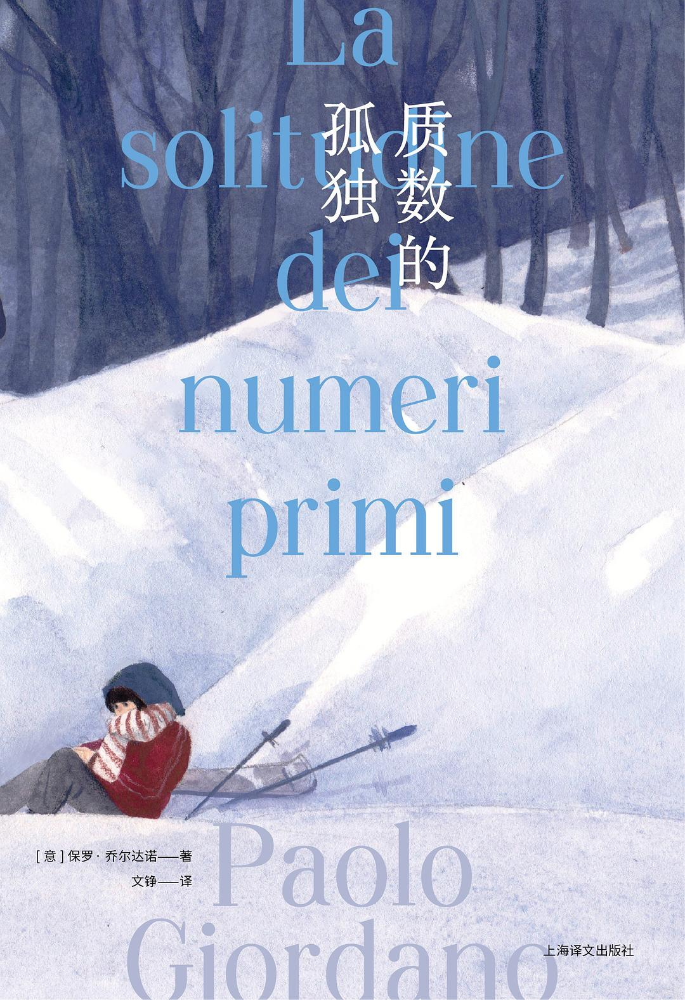

# MY LIBRARY
[秋](./another-page.html)

[爱与黑暗的故事](./docs/A Tale of Love and Darkness.md)

## 鱼没有脚

> 我开车穿过灰色和记忆，穿过熔岩和无常的情绪，那些离去的不会再回来，可我回来了，毫不犹豫地回来了，以每小时一百一十千米的速度，回到凯夫拉维克。 
> 凯夫拉维克，一个并不存在的地方。 我不知道这是否关于那句无礼的诗，关于它所在的那首诗所讲述的真理，但去往凯夫拉维克的旅途总像要驶离这个世界，前往虚无。

###### BOOKS

| 冰岛往事  | 名字   |
|:---------|:-------|
| 1        |狂暴海  |
| 2        |捞星星  |
| 3        |写信人  |

### There's a horizontal rule below this.

* * *

### La solitudine dei numeri primi

